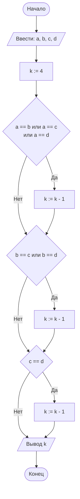

## Отчет по лабораторной работе № 1

#### № группы: `ПМ-2501`

#### Выполнил: `Калинин Арсений Александрович`

#### Вариант: `9`

### Cодержание:

- [Постановка задачи](#1-постановка-задачи)
- [Входные и выходные данные](#2-входные-и-выходные-данные)
- [Выбор структуры данных](#3-выбор-структуры-данных)
- [Алгоритм](#4-алгоритм)
- [Программа](#5-программа)
- [Анализ правильности решения](#6-анализ-правильности-решения)

### 1. Постановка задачи

> Четыре квадрата с длинами сторон A, B, C и D пытаются расположить
> друг над другом, начиная с самого большого. Можно ли разместить все
> квадраты так, чтобы каждый следующий был строго меньше предыдущего?
> Вывести количество квадратов, которые удастся разместить в таком
> порядке. На вход программы подаются натуральные числа A, B, C, D.

Данная задача сводится к нахождению количества уникальных длин сторон квадратов - то есть попарному сравнению длин сторон.

### 2. Входные и выходные данные

#### Данные на вход

На вход программа должна получать 4 натуральных числа - длины сторон квадратов. Нижняя граница - 1, верхняя граница не указана, поэтому возьмём максимально возможное значение `int` - 2147483647

|             | Тип                             | min значение | max значение |
|-------------|---------------------------------|--------------|--------------|
| A (Число 1) | Натуральное положительное число |      1       |  2147483647  |
| B (Число 2) | Натуральное положительное число |      1       |  2147483647  |
| C (Число 3) | Натуральное положительное число |      1       |  2147483647  |
| D (Число 4) | Натуральное положительное число |      1       |  2147483647  |

#### Данные на выход

Т.к. программа должна вывести количество кавдратов, то на выход мы получим единственное натуральное число, не меньше 1 и не больше 4.

|             | Тип                             | min значение | max значение |
|-------------|---------------------------------|--------------|--------------|
| K (Число 1) | Натуральное положительное число | 1            | 4            |

### 3. Выбор структуры данных

Программа получает 4 натуральные положительные числа. Поэтому для их хранения можно выделить 4 переменные (`a`, `b`, `c` и `d`) типа `int`.

|             | Название переменной | Тип (в Java) | 
|-------------|---------------------|--------------|
| A (Число 1) | `a`                 | `int`        |
| B (Число 2) | `b`                 | `int`        | 
| C (Число 1) | `c`                 | `int`        |
| D (Число 2) | `d`                 | `int`        | 

Результат будем записывать в переменную `k`.

### 4. Алгоритм

#### Алгоритм выполнения программы:

1. **Ввод данных:**  
   Программа считывает четыре натуральных положительных числа – длины сторон квадратов, обозначенные как `a`, `b`, `c` и `d`.

2. **Сравнение чисел:**  
   Программа создаёт переменную `k` – счётчик уникальных длин сторон квадратов – и присваивает ей сразу максимальное значение - 4.
   Далее проверяется, равна ли сторона `a` какой-либо другой стороне, если да – то `k` уменьшается на один.
   Потом проверяется, равна ли сторона `b` какой-нибудь из сторон, кроме `a`, если да – `k` уменьшается на один.
   В конце проверяется последний случай – равны ли `b` и `d`. Если да – `k` уменьшается на один.

3. **Вывод результата:**  
   На экран выводится `k` – счётчик уникальных длин сторон квадратов.

#### Блок-схема



### 5. Программа

```java
import java.io.PrintStream;
import java.util.Scanner;
public class Main {
    public static Scanner in = new Scanner(System.in);
    public static PrintStream out = System.out;
    public static void main(String[] args) {
        int a = in.nextInt();
        int b = in.nextInt();
        int c = in.nextInt();
        int d = in.nextInt();
        int k = 4;
        if (a == b || a == c || a == d) k--;
        if (b == c || b == d) k--;
        if (c == d) k--;
        out.println(k);
    }
}
```

### 6. Анализ правильности решения

Программа работает корректно на всем множестве решений с учетом ограничений.

1. Тест на все разные значения:

    - **Input**:
        ```
        1 2 3 4
        ```

    - **Output**:
        ```
        4
        ```


2. Тест на равенство двух переменных:

    - **Input**:
        ```
        1 1 2 3
        ```

    - **Output**:
        ```
        3
        ```


3. Тест на равенство двух переменных:

    - **Input**:
        ```
        1 2 2 3
        ```

    - **Output**:
        ```
        3
        ```

4. Тест на равенство двух переменных:

    - **Input**:
        ```
        1 2 3 3
        ```

    - **Output**:
        ```
        3
        ```


5. Тест на равенство двух переменных:

    - **Input**:
        ```
        1 2 3 1
        ```

    - **Output**:
        ```
        3
        ```

6. Тест на равенство двух переменных:

    - **Input**:
        ```
        1 2 1 3
        ```

    - **Output**:
        ```
        3
        ```

7. Тест на равенство двух переменных:

    - **Input**:
        ```
        2 1 3 1
        ```

    - **Output**:
        ```
        3
        ```

8. Тест на попарное равенство переменных:

    - **Input**:
        ```
        1 1 2 2
        ```

    - **Output**:
        ```
        2
        ```

9. Тест на попарное равенство переменных:

    - **Input**:
        ```
        1 2 1 2
        ```

    - **Output**:
        ```
        2
        ```

10. Тест на попарное равенство переменных:

    - **Input**:
        ```
        1 2 2 1
        ```

    - **Output**:
        ```
        2
        ```

11. Тест на равенство трёх переменных:

    - **Input**:
        ```
        1 2 2 2 
        ```

    - **Output**:
        ```
        2
        ```

12. Тест на равенство трёх переменных:

    - **Input**:
        ```
        2 1 2 2 
        ```

    - **Output**:
        ```
        2
        ```

13. Тест на равенство трёх переменных:

    - **Input**:
        ```
        2 2 1 2 
        ```

    - **Output**:
        ```
        2
        ```

14. Тест на равенство трёх переменных:

    - **Input**:
        ```
        2 2 2 1 
        ```

    - **Output**:
        ```
        2
        ```

15. Тест на равенство всех переменных:

    - **Input**:
        ```
        1 1 1 1
        ```

    - **Output**:
        ```
        1
        ```
